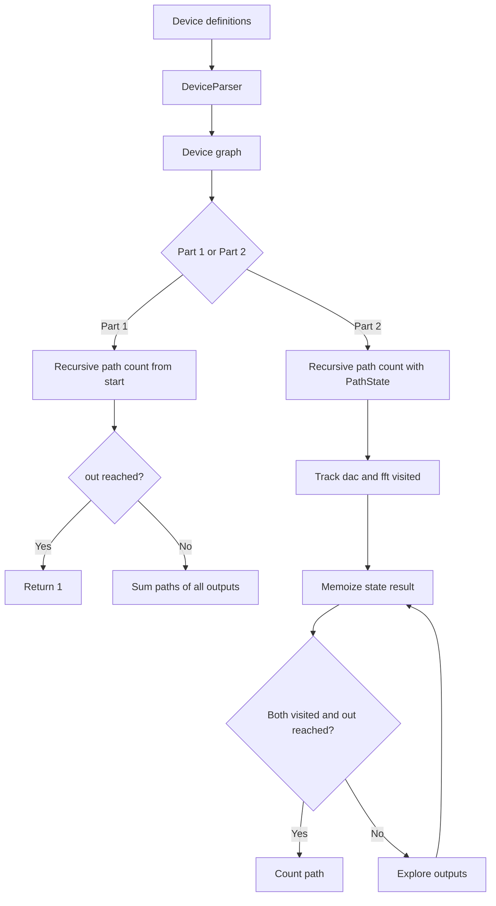

# Day 11: Reactor

The input describes a network of devices. Every device has a name and a list of devices that can be reached from it.

The objective is to count the number of possible paths through the network.

## Part 1

The solution builds a map from device names to `Device` objects so that a device can be accessed directly by name.

Starting from `you`, `PathCounter` recursively follows every possible output. Reaching `out` represents one complete path, so the recursive calls sum the number of paths from every branch.

### Main components

- **Device** — Represents a device and its outgoing connections.
- **DeviceParser** — Converts an input line into a `Device`.
- **PathCounter** — Recursively counts paths from a starting device.
- **Main** — Loads the network and starts the count.

## Part 2

Part 2 starts at `svr` and requires every valid path to visit both `dac` and `fft` before reaching `out`.

The recursive method therefore carries two boolean flags indicating whether each required device has already been visited.

Because many different paths can reach the same device with the same pair of flags, recalculating those paths would be extremely expensive. `PathState` represents this complete state:

- Current device
- Whether `dac` has been visited
- Whether `fft` has been visited

`PathCounter` stores the result for each `PathState` in a memoization map and reuses it whenever the same state is encountered.

This dynamic-programming approach avoids repeatedly traversing identical subgraphs.

## Flow diagram

