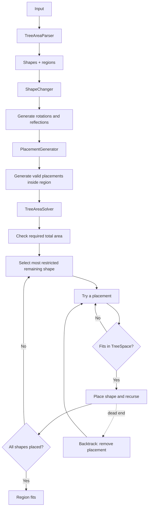

# Day 12: Christmas Tree Farm

The input describes a collection of shapes and rectangular regions. Each region specifies how many copies of each shape must be placed without overlapping.

## Solution

The input is parsed into a `TreeArea` containing all `Shape` and `Region` objects.

Each shape can be rotated and flipped. `ShapeChanger` generates all unique orientations and normalizes their coordinates so they can be placed consistently inside a region.

`PlacementGenerator` then generates every valid position for every orientation of a shape within a particular region.

The actual problem is solved as a backtracking search:

1. Create an empty `TreeSpace` for the region.
2. Keep track of how many copies of each shape are still required.
3. Select a shape with relatively few available placements.
4. Try its possible placements one by one.
5. If a placement does not overlap an occupied cell, place it and continue recursively.
6. If the branch cannot produce a solution, remove the placement and try another one.
7. The search succeeds when all required shapes have been placed.

Before starting the search, the solver also checks whether the total area required by the requested shapes can fit inside the region at all.

### Main components

- **Cell** — Represents a coordinate inside a shape or region.
- **Shape** — Stores the cells occupied by a shape.
- **Region** — Stores the dimensions and required number of each shape.
- **TreeArea** — Groups the parsed shapes and regions.
- **TreeAreaParser** — Parses the complete input.
- **ShapeChanger** — Generates rotations, reflections and normalized orientations.
- **PlacementGenerator** — Generates valid placements inside a region.
- **Placement** — Represents one concrete placement of a shape.
- **TreeSpace** — Tracks occupied cells and handles placing/removing shapes.
- **TreeAreaSolver** — Performs the backtracking search.

The key part of the solution is separating the geometric operations from the search itself: generating orientations and placements is handled independently from deciding which placements form a complete solution.

