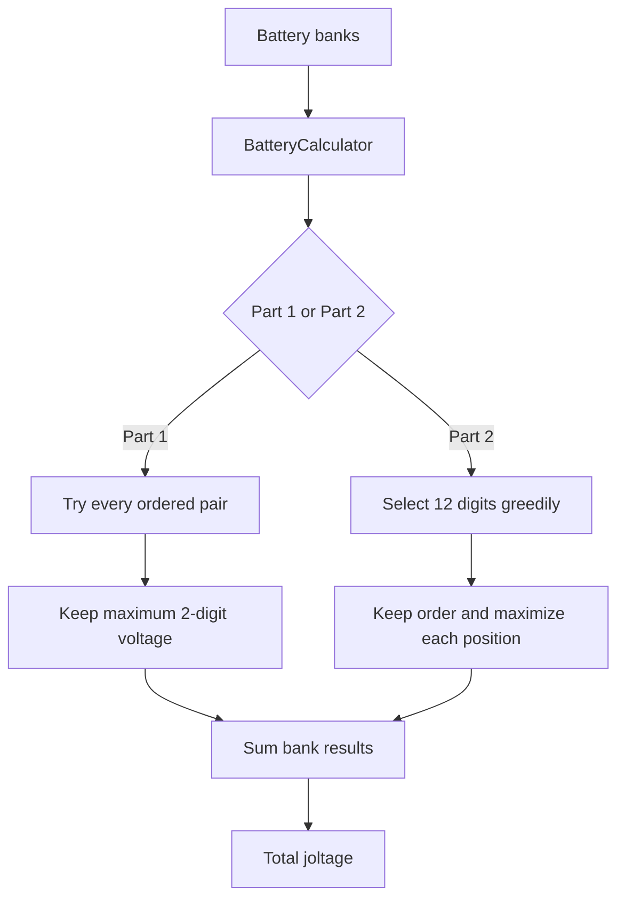

# Day 3: Battery Banks.

The input contains banks of batteries represented by strings of digits. The goal is to select batteries that produce the largest possible voltage.

## Part 1

For each battery bank, the solution searches every possible pair of batteries while preserving their original order.

The two selected digits form a two-digit voltage. The maximum value found for each bank is returned, and `BatteryBankCalculator` sums the results for all banks.

### Main components

- **BatteryCalculator** — Finds the maximum voltage for one bank.
- **BatteryBankCalculator** — Applies the calculator to all banks and accumulates the total.
- **Main** — Loads the input and coordinates the calculation.

## Part 2

The required output is now a **12-digit joltage** instead of a two-digit voltage.

The solution uses a greedy approach. For each position in the resulting 12-digit number, it searches for the largest possible digit while leaving enough batteries available to complete the remaining positions.

Once the best digit is selected, the search continues from the following position. This produces the maximum possible 12-digit value without having to generate every possible combination.

The `BatteryBankCalculator` continues to handle the aggregation of the results for all banks.

## Flow diagram

