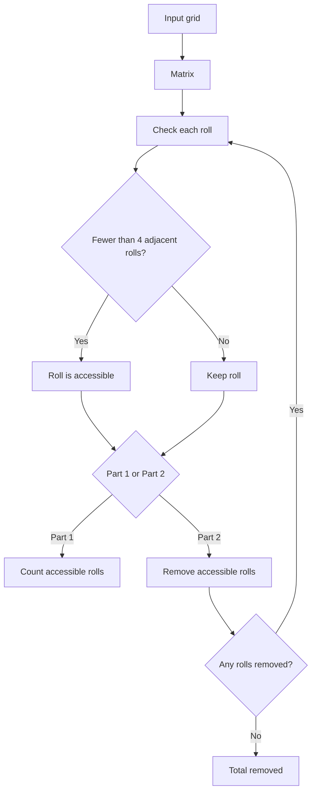

# Day 4: Printing Department

The input is a two-dimensional grid containing rolls of paper (`@`) and empty spaces (`.`).

A roll is accessible when it has fewer than four adjacent rolls among its eight surrounding positions.

## Part 1

The solution builds a `Matrix` from the input and examines every cell.

For each roll, `ReachChecker` checks the eight neighbouring positions and determines whether fewer than four contain another roll. `RollChecker` counts all rolls that satisfy this condition.

### Main components

- **Matrix** — Stores the grid and provides bounds checking and cell access.
- **ReachChecker** — Determines whether an individual roll is accessible.
- **RollChecker** — Iterates through the grid and counts accessible rolls.
- **Main** — Loads the input and starts the calculation.

## Part 2

The accessible rolls must now be **removed repeatedly**. Removing a roll can make neighbouring rolls accessible, so checking the original grid only once is no longer enough.

`RollChecker` therefore performs repeated passes over the matrix:

1. Find every currently accessible roll.
2. Remove it from the matrix by replacing `@` with `.`.
3. Add it to the total removed count.
4. Repeat while at least one roll was removed during the previous pass.

The `Matrix` and `ReachChecker` still provide the grid operations and accessibility rules; Part 2 mainly changes the processing loop so that the grid evolves during the simulation.

## Flow diagram

