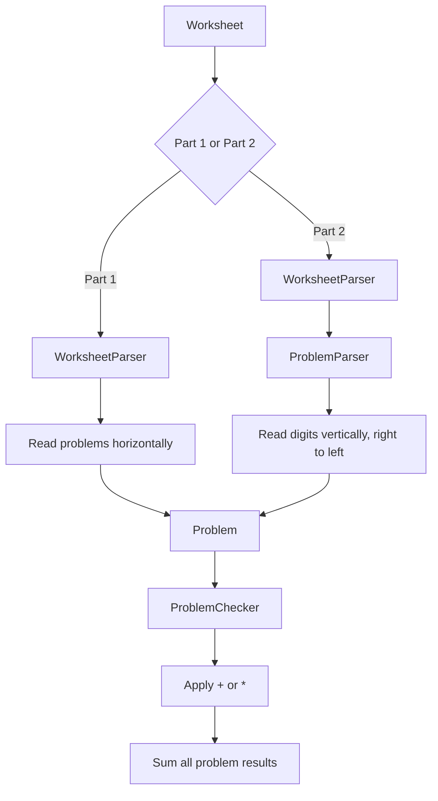

# Day 6: Trash Compactor

The input contains a worksheet with several mathematical problems. Each problem consists of numbers and an operator (`+` or `*`). The main challenge is interpreting the worksheet layout correctly.

## Part 1

In the first part, the problems are read horizontally. Empty columns separate the different problems.

`WorksheetParser` identifies the boundaries of each problem and extracts its numbers and operator into a `Problem` object. `ProblemChecker` then performs the required addition or multiplication.

The flow is:

1. Read the worksheet using `FileProcessor`.
2. Parse the horizontal problems with `WorksheetParser`.
3. Create `Problem` objects.
4. Evaluate each problem with `ProblemChecker`.
5. Sum all individual results.

### Main components

- **Problem** — Represents a mathematical problem with its numbers and operator.
- **WorksheetParser** — Identifies and parses the horizontal problems.
- **ProblemChecker** — Performs the addition or multiplication.
- **Main** — Coordinates the solution.

## Part 2

Part 2 changes how the numbers are interpreted. Instead of reading them horizontally, the digits must be read **vertically from right to left**. Each column represents one number, with its digits read from top to bottom.

`WorksheetParser` first identifies the boundaries of each problem. `ProblemParser` then interprets the contents of each problem using the new right-to-left, column-based reading order. The resulting `Problem` objects can still be evaluated by the same `ProblemChecker` used in Part 1.

The flow is:

1. Read the worksheet using `FileProcessor`.
2. Identify the individual problems with `WorksheetParser`.
3. Parse each problem from right to left with `ProblemParser`.
4. Reconstruct the numbers from their vertical digits.
5. Evaluate each `Problem` with `ProblemChecker`.
6. Sum all individual results.

### Main components

- **Problem** — Common representation shared by both parts.
- **ProblemChecker** — Common calculation logic for `+` and `*`.
- **WorksheetParser** — Finds the boundaries of each problem.
- **ProblemParser** — Specific to Part 2; reconstructs numbers from the vertical columns.
- **Main** — Coordinates the solution.

## Part 1 vs Part 2

The calculation itself stays the same in both parts. The important change is the **way the worksheet is parsed**:

- **Part 1:** numbers are read horizontally.
- **Part 2:** numbers are reconstructed vertically, processing columns from right to left.

This allows the two parts to share the `Problem` and `ProblemChecker` components while keeping their parsing strategies separate.

## Flow diagram

