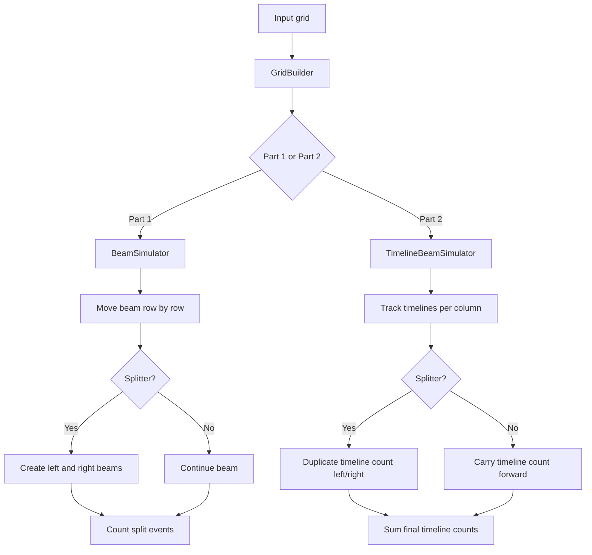

# Day 7: Laboratories

The puzzle represents a grid through which a tachyon beam travels. When a beam reaches a splitter (`^`), it divides into two beams travelling to the left and right.

## Part 1

The solution simulates the beam row by row.

A `Set<Integer>` stores the columns where active beams currently exist. When a beam reaches a splitter, the current position is replaced by the two possible output positions.

Using a set is important because several beams can reach the same column. Those beams are represented by a single active position.

Every splitter reached by an active beam is counted.

### Main components

- **GridBuilder** — Represents the input grid and provides its dimensions and cells.
- **BeamSimulator** — Simulates the active beams and counts the splits.
- **Main** — Loads the grid and starts the simulation.

## Part 2

Part 2 asks for the number of possible **timelines**, rather than simply the number of splitters reached.

A `Map<Integer, Long>` is used instead of a set. The key is the current column and the value is the number of different timelines currently occupying that column.

When a splitter is encountered, the number of timelines is propagated to both neighbouring columns. If multiple paths arrive at the same column, their counts are merged.

This is effectively a dynamic-programming approach: paths that reach the same position are combined instead of being simulated independently.

### Main components

- **TimelineBeamSimulator** — Tracks the number of timelines reaching each column and accumulates them.
- **GridBuilder** — Provides the grid used by both parts.
- **Main** — Executes the timeline simulation.

## Flow diagram

