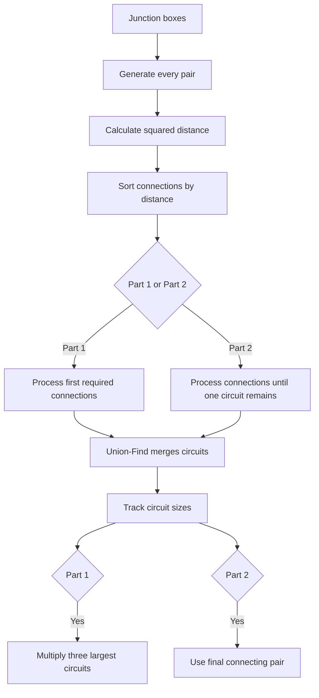

# Day 8: Playground

The input contains junction boxes represented by three-dimensional coordinates. The goal is to connect the boxes into circuits, always considering the shortest available connections first.

## Part 1

The solution generates all possible connections between pairs of junction boxes and orders them by distance.

A **Union-Find** structure is used to maintain the circuits efficiently. When two boxes from different circuits are connected, their circuits are merged and their sizes are updated.

After the required number of connections has been processed, the circuit sizes are sorted and the three largest circuits are multiplied together.

### Main components

- **JunctionBox** — Represents a box using its three-dimensional coordinates.
- **Connection** — Represents a possible connection and its distance.
- **ConnectionFinder** — Generates the possible connections.
- **CircuitManager** — Maintains the circuits using the Union-Find approach.
- **Main** — Processes the required connections and calculates the final product.

## Part 2

The connection process continues until **all junction boxes belong to one circuit**.

`CircuitManager` therefore keeps track of the number of independent circuits. Every successful connection between two different circuits decreases this count.

The connections are processed in distance order. As soon as the circuit count reaches one, the connection that caused the final merge is known.

The final answer is calculated by multiplying the **X coordinates** of the two junction boxes involved in that last connection.

## Flow diagram

